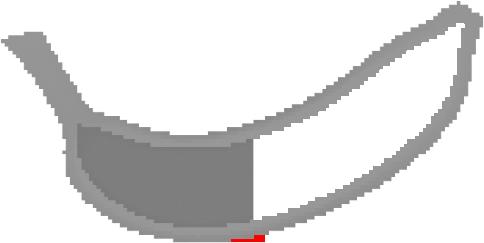

# Make-It-Stand

Make it stand is a project that aims at stabilizing shapes for 3D fabrication. The main idea is to carve the interior of the object to move the center of mass in a way that the object can stand on its own.

# How to run

The code is written in C++ and uses cmake to compile. It has been successfully tested on Linux and MacOS. To compile the code, run the following commands:

```bash
mkdir build
cd build
cmake ..
make
```

To run the code, navigate to the `build` directory and run the following command:

```bash
./make_it_stand <input_file> <output_file> [OPTIONS]
```

where `<input_file>` and `<output_file>` are obj files and the options are:

- `--dim <dimension>`: Dimension of voxel grid (default: 32)
- `--num-rays <number>`: Number of rays per voxel (default: 2)
- `--jitter <jitter>`: Jittering factor for ray directions (default: 0.1)
- `--distance <distance>`: Distance to mesh surface when carving (default: 3)
- `--base-distance <distance>`: Distance to base border when computing stability (default: 1)
- `--max-base-dilation <number>`: Number of iterations for base expansion (default: 10)
- `--help`: Display help message

# Examples

The `Data` directory contains some examples of input files. `Data/Parallelepipeds` contains a set of parallelepipeds inclined with different angles.

<!-- embed fig -->


The figure shows the results of the different parallelepipeds, with carving and base expansion.


The figure shows the results of balancing a banana shape: in white the carving, in red the base expansion. In light and dark gray the exterior and interior voxels, respectively.
